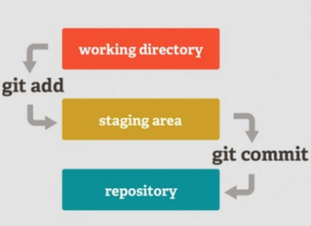

# Git

## O que é Git?

Git é uma ferramenta amplamente usada afim de gerenciar mudanças em documentos e organizar o esforço conjunto de diversas pessoas em projetos de criação de programas. Desenvolvido por Linus Torvalds em 2005, ele nos permite desenvolver e trabalhar com atualizações de software em equipe, de forma colaborativa e segura.

## Qual a história do Git?

Em 2002, O núcleo do Linux, um projeto de código aberto de grande escala, começou a utilizar uma ferramenta proprietária de controle de versão chamada BitKeeper. No entanto, em 2005, o relacionamento entre a comunidade Linux e a empresa responsável pelo BitKeeper deteriorou-se, levando à cobrança de custos para o uso da ferramenta. Esse evento impulsionou a comunidade Linux, especialmente Linus Torvalds, a criar sua própria ferramenta, aprendendo com as experiências adquiridas ao usar o BitKeeper.

Os objetivos principais para a nova ferramenta se baseavam em entregar alta velocidade, simplicidade, forte suporte para desenvolvimento não linear com muitos ramos paralelos, distribuição completa e a capacidade de lidar com projetos de grande porte como o núcleo do Linux de maneira eficiente. Desde seu lançamento em 2005, o Git vem evoluindo incessantemente, tornando-se fácil de usar, mantendo suas qualidades iniciais. Ele é extremamente rápido, eficiente em projetos grandes e possui um sistema robusto para gerenciamento de múltiplos ramos de desenvolvimento.

## Fluxo básico do Git

Existem plataformas de hospedagem de repositórios remotos Git, tais como o GitHub, Gitlab, Bitbucket, entre outros. Essas plataformas nos oferecem diferentes níveis de recursos e integrações, dependendo das necessidades específicas do seu projeto ou equipe, a fim de organizar determinados arquivos de modo que fiquem facilmente evidenciados para a equipe desenvolvedora do projeto. 

### Principais Comandos - Git
- **git init** - Inicializa um repositório local.
- **git clone** - Clona um repositório remoto. É possível escolher qual branch se deseja clonar.
- **git add** - Adiciona determinados arquivos de um repositório local na staging area (uma área intermediária onde as mudanças em seus arquivos são preparadas antes de serem commitadas).
- **git commit** - Salva os arquivos da staging area em uma mensagem.
- **git push** - Envia os commit realizados para um repositório remoto.
- **git pull** - Atualiza o repositório local com as possíveis alterações do repositório remoto.

## O que é Git Flow?

Ao invés de uma única ramificação main, Git Flow é um fluxo de trabalho que usa duas ramificações para registrar o histórico do projeto. A ramificação main armazena o histórico do lançamento oficial, e a ramificação develop serve como uma ramificação de integração para recursos. A primeira etapa é complementar a ramificação main padrão com uma ramificação develop. Esta ramificação vai servir para conter uma nova funcionalidade a ser implementada na ramificação main. o histórico completo do projeto, enquanto a ramificação main vai conter a versão oficial a ser utilizada e roda a produção do cliente.

Cada novo recurso deve residir na própria ramificação, que pode ser enviada por push para o repositório central para backup/colaboração. No entanto, em vez de serem ramificações da ramificação principal, as ramificações feature usam a ramificação develop como pai. Quando um recurso é concluído, ele passa por merge de volta para a ramificação de desenvolvimento. Os recursos não devem nunca interagir direto com a ramificação main.

Uma vez que a ramificação develop adquiriu recursos suficientes para um lançamento (ou uma data de lançamento predeterminada está se aproximando), você bifurca uma ramificação release a partir da ramificação develop. Criar esta ramificação dá início ao próximo ciclo de lançamento, portanto nenhum novo recurso pode ser adicionado depois deste ponto — apenas atualizações de segurança, geração de documentação e outras tarefas relacionadas ao lançamento devem ir nesta ramificação. Quando estiver pronta para ser lançada, a ramificação release passa por merge para a ramificação main e é marcada com o número da versão. Ela também deve passar por merge de volta para a ramificação develop, que pode ter progredido desde que o lançamento foi iniciado.

O uso da ramificação dedicada ao preparo de lançamentos possibilita que uma equipe aperfeiçoe o lançamento atual enquanto outra equipe continua a trabalhar nos recursos para o próximo lançamento. Ele também cria fases de desenvolvimento bem definidas dessa forma, é fácil ver como fica a estrutura do repositório. A elaboração de ramificações de lançamento é outra operação de ramificação simples. Assim como as ramificações de recurso, as ramificações de lançamento são baseadas na ramificação de desenvolvimento. Uma nova ramificação de lançamento pode ser criada usando os seguintes métodos.

### Principais Comandos - GitFlow

- **git branch** - Retorna as branches existentes no repositório e qual sua localização atual.
- **git checkout** - Navega entre as branches de um repositório.
- **git checkout -b** - Cria uma branch apontada para a atual e entra na mesma.
- **git merge** - Funde a branch atual com a branch ramificada desejada.
- **git branch -d** - Exclui uma branch desejada.

(Obs.: Após um merge a branch filha torna-se inútil.)

## Fontes

Começando - Uma Breve História do Git
https://git-scm.com/book/pt-br/v2/Começando-Uma-Breve-História-do-Git

Saiba tudo sobre o Gitflow Workflow
https://www.atlassian.com/br/git/tutorials/comparing-workflows/gitflow-workflow#:~:text=O%20que%20é%20Gitflow%3F,por%20Vincent%20Driessen%20no%20nvie.

