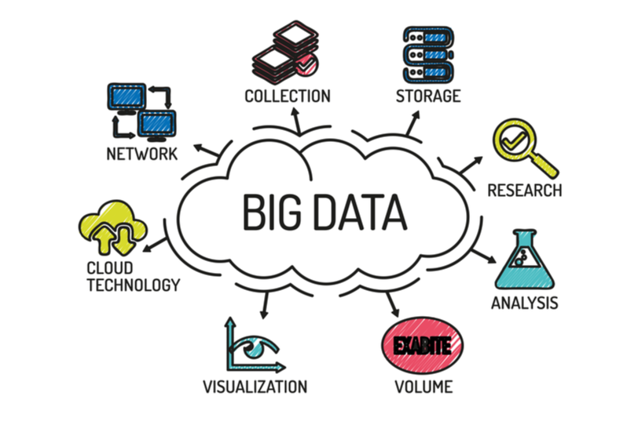
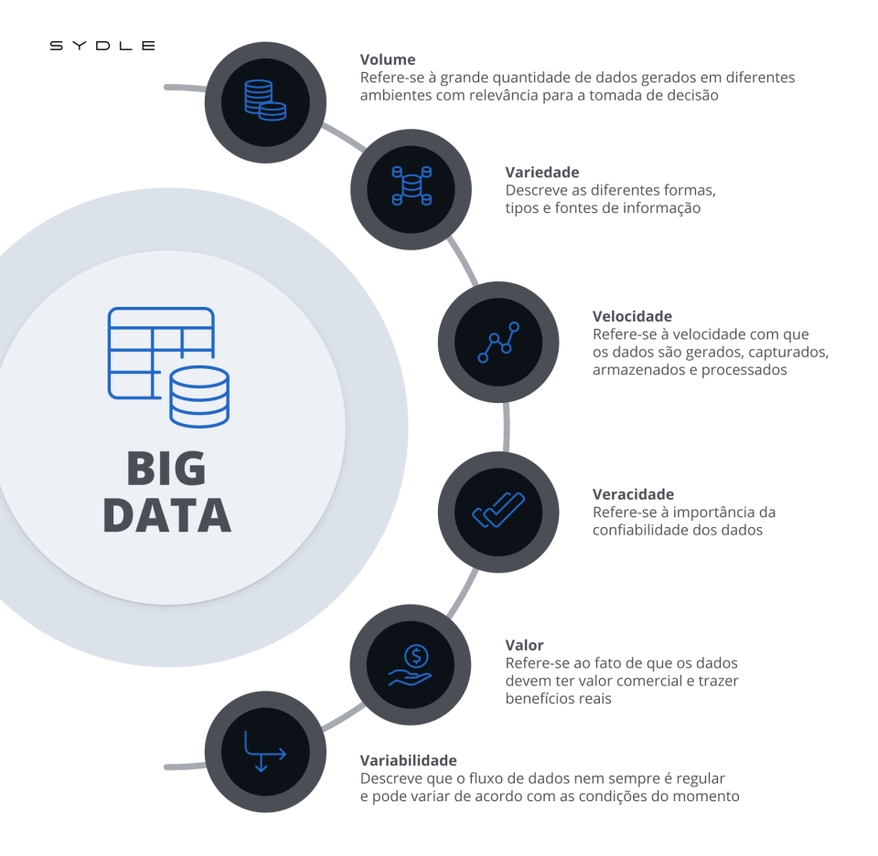

# Big Data
Nome do Estagiário: Newton Cesar Bussmeyer Gonçalves Costa.

Data: 12/08/2024

Módulos/Etapas Feitas:

1. O que é Big Data?
2. A Existência dos 3 Vs
3. Big Data e Sua Importância
4. Como é o Processo de Análise
5. O Futuro do Mercado Big Data
6. Fontes
## O que é Big Data?

Quando falamos de Big Data, estamos falando de dados em quantidade exorbitante. É a combinação de possíveis dados semi, não ou positivamente estruturados que são mineirados, armazenados, coletados e analizados a fim de se chegar a conclusões que impactarão uma tomada de decisão.

Embora não exista uma quantidade mínima requerida de dados para determinar o que é ou não Big Data, o espaço de armazenamento  dos bancos assim considerados costumam se situar na casa dos terabytes, pentabytes e em alguns casos, até mesmo exabytes de dados coletados ao longo do tempo, em alguns casos.

## A Existência dos 3 Vs

Tudo começou em 2001, quando Doug Lany, um exímio analista de dados, identificou pela primeira vez a existência dos 3 Vs que eram essenciais em análise de dados:

- Volume: Do alto volume de dados em muitos ambientes, tende a ser a característica mais presente no termo Big Data;

- Variedade: Da vasta variedade de tipos de dados frequentemente armazenados em sistemas de Big Data, se refere aos dados que alí podem ser armazenados (estrutudados, semi e não estruturados);

- Velocidade: Devido à alta velocidade em que os dados são gerados, coletados e processados.

Diversos outros Vs como veracidade, valor e variabilidade foram adicionados mais recentemente para ajudar na compreensão do que é essencial ao definir Big Data.

## Big Data e Sua Importância

No mundo moderno onde informação é dinheiro, eventualmente toda empresa tem de utilizar sistemas de consulta de dados para melhorar suas operações de compra, venda, tratativa com fornecedores e etc. Quando oos dados a serem processados excedem a capacidade comum de armazenamento, é então que os sistemas Big Data são utilizados.

O ramo da medicina hoje é um grande usuário de Big Data, utilizando de grandes bancos de dados para armazenar sintomas e posteriormente os mesmos serem úteis para diagnosticar doenças.

De modo geral, qualquer empresa que venha a utilizar os sistemas Big Data tem vantagem sobre suas concorrentes pois seu processamento de dados vai auxiliar grandemente nas tomadas de decisões alí necessárias, levando a correções e novos rumos mais rápidos e eficientes que as outras disputantes.

## Como é o Processo de Análise

Para alcançar resultados precisos e relevantes em aplicações de análise de big data, é essencial que os cientistas de dados e analistas compreendam plenamente os dados disponíveis e tenham uma ideia clara do que pretendem encontrar. Por isso, a preparação dos dados se torna uma etapa fundamental no processo analítico. Essa preparação envolve o perfilamento, a limpeza, a validação e a transformação dos conjuntos de dados.

Após a coleta e preparação dos dados para análise, diversas disciplinas de ciência de dados e análise avançada podem ser utilizadas para executar diferentes tipos de aplicações.

Ferramentas especializadas que oferecem funcionalidades de análise de big data são empregadas nesse estágio. Entre as disciplinas aplicadas estão o aprendizado de máquina, incluindo o aprendizado profundo, a modelagem preditiva, a mineração de dados, a análise estatística, a análise de dados em tempo real e a mineração de texto.

## O Futuro do Mercado Big Data

Diversas tecnologias emergentes têm o potencial de impactar a maneira como o big data é coletado e utilizado. As seguintes tendências tecnológicas têm grandes chances de ter o maior impacto no futuro do big data:

#### Análise baseada em IA e aprendizado de máquina.
Os grandes conjuntos de dados continuam a crescer, tornando-se cada vez mais difíceis de serem analisados manualmente. Algoritmos de IA e aprendizado de máquina estão se tornando indispensáveis para realizar análises em larga escala e até para tarefas iniciais, como a limpeza e o pré-processamento dos dados. Ferramentas automatizadas de aprendizado de máquina provavelmente desempenharão um papel importante nessa área.

#### Armazenamento aprimorado com maior capacidade.
As capacidades de armazenamento em nuvem estão em constante evolução. Data lakes e data warehouses, que podem estar localizados tanto no local quanto na nuvem, surgem como soluções promissoras para o armazenamento de big data.

Maior foco na governança de dados. Com o aumento do volume de dados em uso, a governança de dados e as regulamentações tendem a se tornar mais rigorosas e comuns, exigindo mais esforços para a proteção e a regulamentação dos dados.

#### Computação quântica.

Embora menos discutida do que a IA, a computação quântica tem o potencial de acelerar as análises de big data com seu poder de processamento superior. Ainda está em uma fase inicial de desenvolvimento e é acessível apenas a grandes corporações com recursos significativos.

## Fontes

Big Data Definition: https://www.techtarget.com/searchdatamanagement/definition/big-data