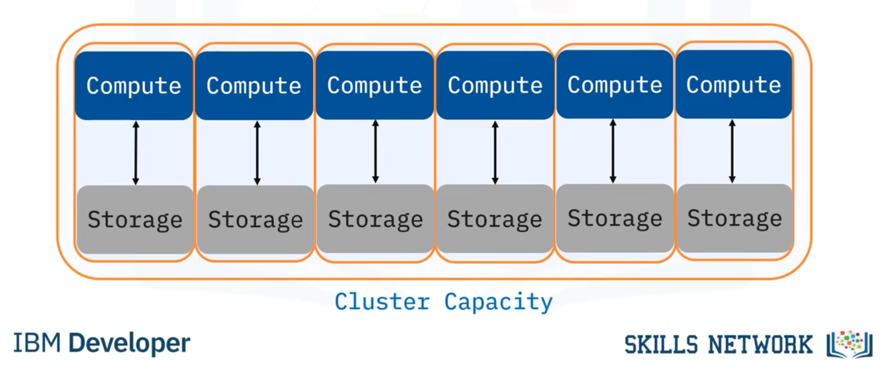

# Big Query
Nome do Estagiário: Newton Cesar Bussmeyer Gonçalves Costa.

Data: 02/08/2024

Módulos/Etapas Feitas:

1. O que é Big Query?
2. As Vantagens do Big Query

## O que é Big Query?

Big Query é, dentre muitas outras, uma das ferramentas oferecidas pela plataforma do Google Cloud. Ela serve para facilitar e agilizar o processo de consultas em Big Data.

## Processamento Paralelo

Uma de suas maiores vantagens é ser ministrado usando SQL, o que faz com que os inputs de comando sejam acessíveis para quem o está operando. Além disso, sua arquitetura é construída de forma que ele realiza os processos em paralelo, isso faz com que a análise de grande volume de dados ocorra de forma muito mais otimizada.

Quando executamos uma consulta no BigQuery, o sistema automaticamente divide essa tarefa em várias subtarefas menores. Essas subtarefas são processadas simultaneamente em diferentes máquinas (nós) dentro da infraestrutura do Google Cloud. Como cada nó trabalha em paralelo para processar sua parte dos dados, isso faz com que ao invés de um único processador trabalhar sequencialmente em todo o conjunto de dados, múltiplos processadores lidam com diferentes partes ao mesmo tempo. Essa simultaneidade é o que permite o processamento rápido, mesmo com datasets massivos.

## Custo Por Uso

#### Armazenamento
O BigQuery cobra pelo volume de dados armazenados em suas tabelas. O custo é calculado com base na quantidade de dados armazenados em gigabytes (GB) por mês. Existem dois tipos de armazenamento:

- Ativo: Refere-se aos dados que foram carregados ou modificados nos últimos 90 dias. Esses dados são mais caros de armazenar, já que são considerados ativos e potencialmente mais acessados.

- Longa Duração: Após 90 dias sem modificações, os dados são classificados como de longa duração, resultando em um custo reduzido de armazenamento. Isso incentiva o armazenamento econômico de grandes volumes de dados que não são frequentemente acessados.

#### Consultas
 O BigQuery também é cobrado baseado no volume de dados processados durante a execução de consultas. Esse custo é calculado com base na quantidade de dados lidos pelas consultas, medida em terabytes (TB). Existem dois modos principais:

- Sob Demanda: No modelo sob demanda, você paga pelo volume de dados que suas consultas processam. Esse é o modelo padrão e é ideal para uso variável ou imprevisível.

- Taxa Fixa (Flat-Rate): Para organizações que executam um grande número de consultas, o BigQuery oferece um plano de taxa fixa, onde você paga um valor mensal para uma quantidade de capacidade de consulta predefinida. Esse modelo é útil para previsibilidade de custos em operações de grande escala.

## Consultas Otimizadas
Este é um dos principais recursos que contribuem para o alto desempenho e a eficiência na consulta de grandes volumes de dados. Ele combina várias técnicas e tecnologias para garantir que as consultas sejam executadas de forma rápida e econômica. o BigQuery conta com várias tecnologias que tornam essas consultas mais práticas, entre elas, podemos citar:

- Reutilização de Resultados: O BigQuery automaticamente armazena em cache os resultados das consultas recentes. Se a mesma consulta for executada novamente, o sistema pode retornar os resultados armazenados em cache, em vez de reprocessar os dados. Isso reduz o tempo de resposta e os custos de processamento, especialmente para consultas repetitivas.

- Leitura de Dados Modificados: Em certos cenários, o BigQuery pode realizar consultas incrementais, onde apenas os dados que foram alterados desde a última execução da consulta são processados. Isso é particularmente útil em análises contínuas ou em tempo real, onde o volume de dados é grande, mas apenas uma pequena fração muda com frequência.

- Ajuste Dinâmico de Recursos: Durante a execução de uma consulta, o BigQuery pode escalar automaticamente os recursos de computação para atender às demandas específicas da consulta. Isso significa que, conforme a consulta se torna mais complexa ou o volume de dados cresce, o sistema aloca mais recursos para manter o desempenho ideal.

