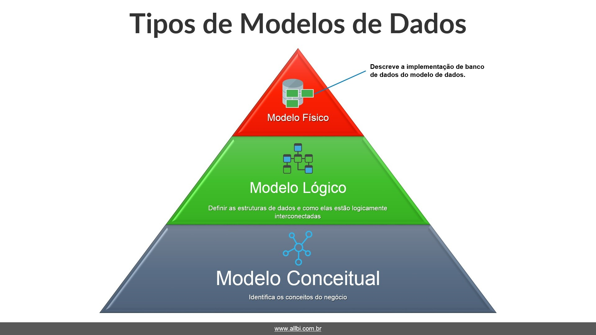
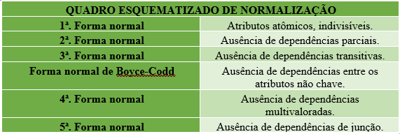

# Modelagem de Dados
Nome do Estagiário: Newton Cesar Bussmeyer Gonçalves Costa.

Data: 19/08/2024

Módulos/Etapas Feitas:

1. O que é Modelagem de Dados?
2. Tipos de Modelos
3. Normalização
4. Boas Práticas

## O que é Modelagem de Dados?
A modelagem de dados é o processo de definir e estruturar os dados que uma organização utiliza, de forma a garantir que eles sejam armazenados, acessados e manipulados de maneira eficiente e consistente. Ela envolve a criação de representações visuais dos dados, frequentemente na forma de diagramas, que ilustram as entidades, atributos e relacionamentos dentro de um sistema de informação. Esses modelos servem como um mapa para o desenvolvimento de bancos de dados, permitindo que as organizações organizem seus dados de maneira lógica e compreensível.

A modelagem de dados também ajuda a identificar redundâncias, assegurar a integridade dos dados e garantir que os requisitos de negócio sejam adequadamente atendidos. Ela é uma etapa crucial no design de sistemas de informação, pois influencia diretamente a performance, a escalabilidade e a flexibilidade das soluções de TI.

## Tipos de Modelos

- Modelo Conceitual: O modelo conceitual é uma representação de alto nível dos dados, focada em descrever as entidades e seus relacionamentos dentro de um domínio de negócios, sem considerar detalhes técnicos. Ele é usado principalmente para comunicar a estrutura e as necessidades de dados aos stakeholders não técnicos.

- Modelo Lógico: O modelo lógico é uma refinamento do modelo conceitual, adicionando detalhes técnicos, como tipos de dados, chaves primárias e estrangeiras, e cardinalidade dos relacionamentos. Ele ainda é independente do sistema de banco de dados que será utilizado.

-  Modelo Físico: O modelo físico traduz o modelo lógico em uma estrutura de banco de dados específica, detalhando como os dados serão armazenados, acessados e gerenciados no SGBD escolhido. Esse modelo considera aspectos como desempenho, armazenamento e restrições do sistema.

## Normalização

Esse processo divide grandes tabelas em tabelas menores e estabelece relacionamentos entre elas, seguindo um conjunto de regras chamadas "formas normais". O objetivo principal da normalização é garantir que os dados sejam armazenados de forma eficiente e sem duplicações desnecessárias, o que facilita a manutenção e evita inconsistências.

### As Formas Normais

Formas Normais são critérios específicos que precisam ser atendidos antes de passar para a próxima. As três primeiras formas normais (1FN, 2FN, e 3FN) são as mais comuns e amplamente utilizadas:

1. Primeira Forma Normal (1FN): Uma tabela está na 1FN se todos os valores de suas colunas forem atômicos, ou seja, indivisíveis. Isso significa que cada coluna deve conter apenas um valor por registro, e não listas de valores ou valores compostos.

2. Segunda Forma Normal (2FN): Uma tabela está na 2FN se estiver na 1FN e todos os atributos não-chave forem totalmente dependentes da chave primária. Isso significa que não pode haver dependência parcial, onde um atributo depende apenas de parte da chave primária (em caso de chaves compostas).

3. Terceira Forma Normal (3FN): Uma tabela está na 3FN se estiver na 2FN e todos os atributos não-chave forem dependentes apenas da chave primária, sem depender de outros atributos não-chave (ausência de dependência transitiva).

## Boas Práticas

Boas práticas na modelagem de dados são essenciais para garantir que o banco de dados seja eficiente, escalável, fácil de manter e que atenda às necessidades do negócio. Implementar essas práticas desde o início do projeto pode prevenir problemas futuros e facilitar a evolução do sistema à medida que os requisitos mudam. Vamos considerar algumas das principais boas práticas a serem adotadas:

- Descrição Clara: Toda a modelagem deve ser bem documentada, com descrições claras de todas as entidades, atributos e relacionamentos. Isso inclui não apenas os diagramas de entidades-relacionamentos, mas também explicações textuais sobre o propósito e uso de cada elemento.

- Atualização Contínua: A documentação deve ser mantida atualizada conforme o banco de dados evolui. Mudanças no modelo devem ser refletidas imediatamente na documentação, evitando confusões e facilitando a colaboração entre equipes.

- Colaboração: Envolver stakeholders do negócio, desenvolvedores e administradores de banco de dados no processo de modelagem é crucial.

- Validação: Antes de avançar com a implementação, o modelo de dados deve ser validado por todas as partes interessadas. Isso pode incluir revisões formais e reuniões para discutir o modelo proposto.

- Padrões Consistentes: Adote convenções de nomenclatura claras e consistentes para tabelas, colunas, índices e outros objetos de banco de dados.

- Significado Claro: Os nomes dos objetos devem ser descritivos e refletir o conteúdo ou a função, o que ajuda na leitura e manutenção do modelo.